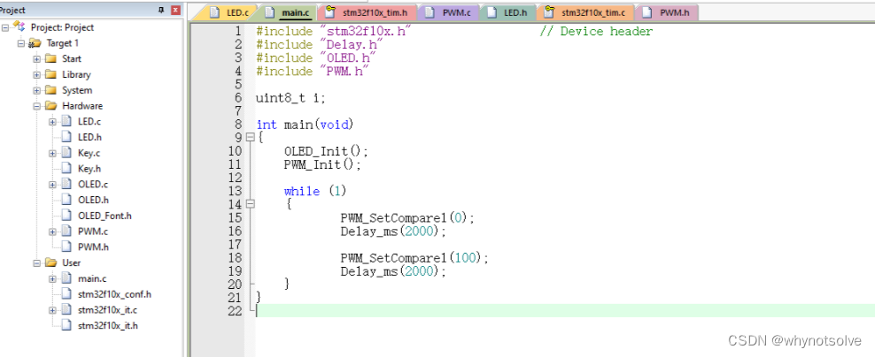

---
实验一. Nios-II编程入门
----------------------------

#### 一. 实验目标：

#### 学习 Quartus 、Platform Designer、Nios-II SBT 的基本操作；

#### 初步了解 SOPC 的开发流程，基本掌握 Nios-II 软核的定制方法；

#### 掌握 Nios-II 软件的开发流程，软件的基本调试方法。

##### 实验原理：

本实验的目的是通过Nios II处理器控制连接到DE2-115开发板的LED灯，实现流水灯效果。实验原理主要包括以下几个步骤：

1. **硬件连接**：首先，需要将LED灯连接到DE2-115开发板上预先定义的GPIO（通用输入输出）引脚上。这些引脚可以由Nios II处理器直接控制。
2. **SOPC Builder设计**：在Quartus II软件中使用SOPC Builder工具创建一个系统，该系统包含Nios II处理器和GPIO组件。GPIO组件用于将Nios II处理器的数字信号转换为物理引脚的电平信号，从而控制LED灯的亮灭。
3. **Nios II编程**：在Nios II IDE（集成开发环境）中，使用C或C++编写程序，该程序通过操作GPIO组件来控制LED灯的亮灭顺序和时间间隔，从而实现流水灯效果。
4. **编译和下载**：将编写好的程序在Nios II IDE中编译成可执行的二进制文件，并通过下载工具将其下载到FPGA（现场可编程门阵列）中的Nios II处理器上运行。
5. **运行和调试**：启动DE2-115开发板，观察LED灯的流水灯效果。如果效果不符合预期，可以通过Nios II IDE的调试功能进行调试和优化。

#### 新建Quartus项目，选择使用芯片EP4CE115F29C7

点击 **Tools** 下拉菜单下的 **Platform Designer** 工具，出现对话框：

#### 设置时钟主频为50M并添加Nios-II Processor

#### 流水灯控制程序：

    #include "system.h"
    #include "altera_avalon_pio_regs.h"
    #include "alt_types.h"
    #include "stdio.h"
    const alt_u8
    led_data[8]={0x01,0x02,0x04,0x08,0x10,0x20,0x40,0x80};
    int main (void)
    {
     int count=0;
     alt_u8 led;
     volatile int i;
     while (1)
     { if (count==7)
     {count=0;}
     else
     {count++;}
     led=led_data[count];
     IOWR_ALTERA_AVALON_PIO_DATA(PIO_LED_BASE, led);
     i = 0;
     printf("Hello Nios-II\n");
     while (i<500000)
     i++;
     }
     return 0;
    }

#### 编译工程：

点击保存，选择hello_wold_bsp，右键后，选择Nios II中的Generate BSP，编译应用文件，选择hello_world右键后，点击Build Project

#### 注意事项：

* **时钟和复位**：确保为Nios II处理器和所有外设组件提供了正确的时钟和复位信号。
* **GPIO配置**：在SOPC Builder中正确配置GPIO引脚的方向（输入或输出）。
* **UART配置**：确保在SOPC Builder和Nios II代码中正确配置了UART的参数。
* **调试**：使用Nios II IDE的调试功能来检查代码的执行情况，并验证GPIO和UART的操作是否正确。

### 总结与心得：

这次实验让我掌握了Nios II编程的基础知识。在编写控制LED流水灯和串口通信的程序时，我学习了如何使用Nios II IDE进行编程、调试和下载程序。掌握了如何操作GPIO和UART等外设。

##### 参考文献：

https://blog.csdn.net/xwmrqqq/article/details/115937457

#### https://blog.csdn.net/qq_43279579/article/details/115953871

